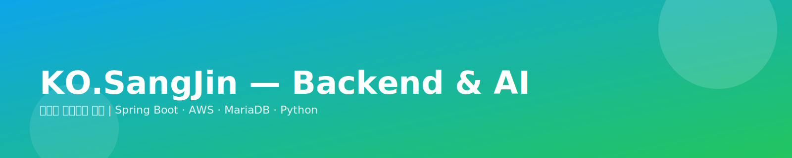

  <picture>
    <source media="(prefers-color-scheme: dark)" srcset="./hero-dark.svg">
    
  </picture>

# 고상진 KO.SangJin
> 🎯 백엔드 개발자가 목표

  <!-- 필요 없으면 아래 배지는 지워도 됩니다 -->
  
  
  
  
  
  
  

---

## 📚 목차
- [자기소개](#-자기소개)
- [이력서](#-이력서)
- [취미](#-취미)
- [기술](#-기술)

---

## 👋 자기소개
- 현재는 **백엔드 포지션** 개발자가 목표입니다.  
- 아직 못 배웠거나 부족한 기술은 **빠르게 학습**하고, **성실함과 책임감**을 강점으로 삼고 있습니다.  
- 최근에는 **자격증**과 **AI 개발**에 집중하여, 작년보다 더 좋은 발전을 이루고자 합니다.  
- **AI를 활용**해 문제를 스스로 해결하려 노력하며, 필요할 때는 적극적으로 질문해 더 나은 개발자가 되기 위해 성장하고 있습니다.  
- 면접에서 깊게 이야기하고 싶은 주제: 특별히 정해둔 주제는 없지만, **너무 이론적인 질문이나 돌발 질문**에는 생각이 잠시 막힐 수 있습니다.

> [!TIP]
> 강점: 꾸준함 · 성실함 · 책임감 / 학습 의지  
> 선호: 실무 중심의 문제 해결 대화

---

## 📝 이력서
- **학력/교육**  
  - 24년도 졸업 후, **풀스택 AI 개발 부트캠프 수료**.
- **PDF**: [📄 자소서 다운로드](./고상진_자기소개서.pdf) *(파일을 리포지토리에 추가하면 링크가 동작합니다) 이력서를 새로 등록하면 입력하겠습니다.* 
- **PPTX**: [📄 1차 팀 프로젝트 포트폴리오 다운로드](./고상진_포트폴리오_1.pdf) *(파일을 리포지토리에 추가하면 링크가 동작합니다) 이력서를 새로 등록하면 입력하겠습니다.*
- **PPTX**: [📄 2차 팀 프로젝트 포트폴리오 다운로드](./고상진_포트폴리오_2.pdf) *(파일을 리포지토리에 추가하면 링크가 동작합니다) 이력서를 새로 등록하면 입력하겠습니다.*   
---

## 🎮 취미
- 게임을 좋아합니다. 직접 플레이하는것도 좋지만 다양한 게임의 정보를 보는것도 좋아합니다. 
- 야구 **KIA Tigers** 구단의 팬입니다. 문학경기장으로 직관을 가는 편입니다.  
- 현재 **정보처리기사 필기**를 준비 중입니다. (어렵네요!)  
- 각종 경제,시사,세계 뉴스를 즐겨보는 편입니다.

---

## 🛠 기술

### 💻 언어
`C` `Python` `Java`  
- 자격증 공부를 통해 세 언어를 모두 익혔고, **초급 이상** 수준이라고 생각합니다.

### ⚙️ 프레임워크 & 라이브러리
- **IntelliJ**로 **Spring Boot** 개발 경험.

### ☁️ 인프라 & DevOps
- **AWS**: EC2, RDS, S3 , Docker 활용  
- **도구**: MobaXterm, FileZilla  
- **메모**: AI 서버를 별도 구성하여 **두 서버가 상호 영향 없이 동시에 작동**하도록 구현한 경험이 있습니다.  

### 🗄 데이터베이스 & 클라이언트
- **MariaDB**, **HeidiSQL**, **PostgreDB** 사용

### 🔧 도구
- **GitHub** 사용  
  - IntelliJ 내장 기능으로 사용도 해보고 GitBash를 자주 이용합니다.

### 🤖 AI
- **AI 이미지 학습** 경험  
  - Google **Colab**에서 **YOLOv5**를 활용, **Python**으로 구현
  - ""LLM""을 이용하여 **Chatbot**을 구현

  
🔎 사용/학습 도구 배지(펼치기)

   
  
  
  

### 📈 현재 학습 중
- 복습을 통해 **기초를 탄탄히** 하며, 과정을 **정확히 따라** 실력을 끌어올리는 중  
- **AI 분야**에 지속적인 관심을 가지고, 이전보다 **더 좋은 결과**를 만드는 것을 목표로 하고 있습니다.

---

_마지막 업데이트: 2026-03-02_

<a href="#고상진-kosangjin">⬆ 맨 위로</a>
